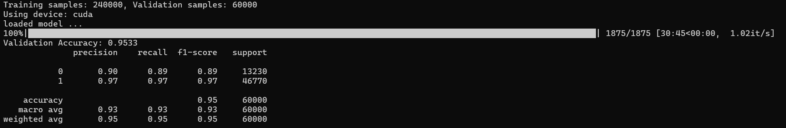
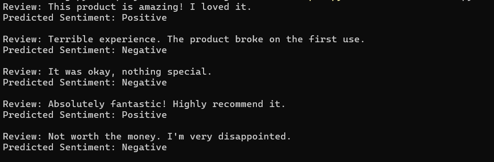

# Fine tuning BERT On Amazon Fine Food Reviews Dataset

This project is the to recreate the official paper proposed by Mengmeng Ji on fine tuning bert model.

[Official paper](./Fine-tuning%20BERT%20On%20Fine%20Foods.pdf)

## ⚠️ **Warning:**

+  Change the location of the dataset file in `fine_food_train.py` file.
+ Since my hardware limitation I have only used the sample size of `300000`. Feel free the change the parameters in the `fine_food_train.py` file

## Results

### <u>Validation results</u>

### <u>Inference results</u>

