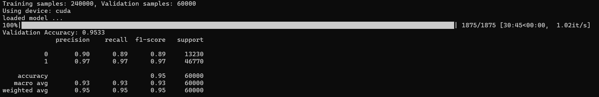
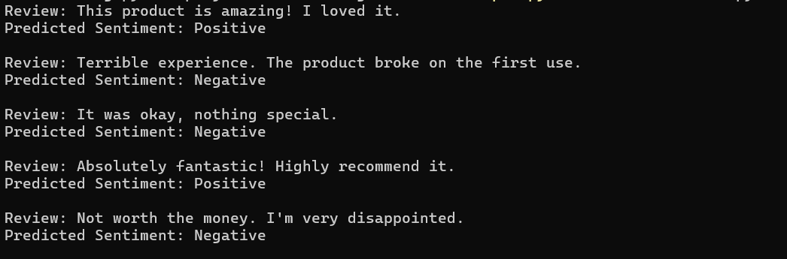

# Fine-Tuning BERT for Sentiment Analysis on Amazon Fine Food Reviews

[](https://www.python.org/downloads/)
[](https://pytorch.org/)
[](https://huggingface.co/docs/transformers/index)
[](https://huggingface.co/)  

This project is the to recreate the official paper proposed by Mengmeng Ji on fine tuning bert model. The goal is to classify a food review as either **positive** or **negative** based on its text.

[Official paper](./Fine-tuning%20BERT%20On%20Fine%20Foods.pdf)

## Project Overview

Sentiment analysis is a fundamental task in Natural Language Processing (NLP). This project serves as a practical, step-by-step guide to fine-tuning a pre-trained BERT model from the Hugging Face `transformers` library. We treat the problem as a binary classification task, where we predict if a review's sentiment is positive (Score 4-5) or negative (Score 1-3).

**Key Features:**
- End-to-end workflow from data loading to model inference.
- Utilizes the `BERT-base-uncased` model.
- Implements a custom classifier head on top of BERT.
- Demonstrates training with a `Trainer` and custom training loops.
- Includes evaluation metrics and inference examples.

## Dataset

We use the [Amazon Fine Food Reviews](https://www.kaggle.com/datasets/snap/amazon-fine-food-reviews) dataset from Kaggle.

- **Size:** 568,454 food reviews from Amazon.
- **Columns Used:**
  - `Text`: The text of the review (our input feature).
  - `Score`: The rating from 1 to 5 (our target label).
 
## Installation & Setup

1.  **Clone the repository:**
    ```bash
    git clone https://github.com/Hemanth2332/fine-tuning-bert-on-fine-food.git
    cd fine-tuning-bert-on-fine-food
    ```

2.  **Create a virtual environment (recommended):**
    ```bash
    python -m venv venv
    source venv/bin/activate  # On Windows: venv\Scripts\activate
    ```

3.  **Install required dependencies:**
    ```bash
    pip install -r requirements.txt
    ```
**Download the Dataset:**
    - Download the `Reviews.csv` file from the [Kaggle dataset page](https://www.kaggle.com/datasets/snap/amazon-fine-food-reviews).
    - Place it in the root directory of the project or in a `data/` folder.

  ## ⚠️ **Important Note:**

+  Change the location of the dataset file in `fine_food_train.py` file (If needed).
+  Because of my hardware limitation only  `300000` sample size is used. Feel free the change the parameters in the `fine_food_train.py` file 😊

## Usage

### 1. Data Preparation and Preprocessing
The script `preprocess.py` (or the relevant Jupyter notebook) handles:
- Loading the CSV file.
- Mapping scores to binary labels.
- Balancing the dataset by sampling an equal number of positive and negative reviews.
- Splitting the data into training and validation sets.
- Tokenizing the text using the BERT tokenizer.

### 2. Model Definition
The model is defined in `model.py` (or within the main script). It consists of:
- A pre-trained BERT model from Hugging Face (`bert-base-uncased`).
- A dropout layer for regularization.
- A linear classification head that takes the `[CLS]` token embedding and outputs a single logit for binary classification.

### 3. Training
You can train the model using the provided script `train.py`.

**Key Training Arguments:**
- **Learning Rate:** 2e-5
- **Batch Size:** 16
- **Epochs:** 3 (standard for BERT fine-tuning)
- **Optimizer:** AdamW

To start training, run:
```bash
python train.py
```
The training process will display loss and accuracy metrics, and the best model will be saved to the `./model/` directory.

### 4. Evaluation
The model is evaluated on the held-out validation set. The script calculates:
- **Accuracy**
- **Precision**
- **Recall**
- **F1-Score**
- **Classification Report**
  
## Results

After fine-tuning for 3 epochs, the model typically achieves the following performance on the validation set:

| Metric    | Score  |
|-----------|--------|
| Accuracy  | ~95%   |
| F1-Score  | ~95%   |

### <u>Validation results</u>


### <u>Inference results</u>


## Future Work

- Extend to a 5-class classification (1 to 5 stars).
- Experiment with other pre-trained models like `RoBERTa` or `DistilBERT`.
- Deploy the model as a web API using FastAPI or Flask.
- Create a simple web interface with Gradio or Streamlit.

## Contributing

Contributions, issues, and feature requests are welcome! Feel free to check the [issues page](https://github.com/Hemanth2332/fine-tuning-bert-on-fine-food/issues).

## Acknowledgments

- Hugging Face for the incredible [`transformers`](https://github.com/huggingface/transformers) library.
- Amazon for the [Fine Food Reviews dataset](https://www.kaggle.com/datasets/snap/amazon-fine-food-reviews).
- The NLP community for excellent tutorials and resources.

---


